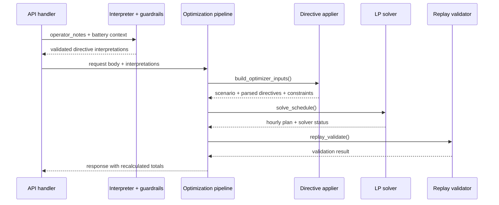

# GridWise Architecture

## Purpose

GridWise is a 24-hour campus energy scheduling service. It combines natural-language operator guidance with a deterministic optimization engine. The language model is responsible for translating notes into structured directives; it is not responsible for calculating or validating the energy schedule.

## Architectural Principles

1. **Interpretation and optimization are separate concerns.** Natural language is converted into a small, explicit directive vocabulary before it reaches the solver.
2. **Every model output crosses a deterministic guardrail.** Invalid structure, unsupported directives, malformed hours, and invalid numeric values are rejected.
3. **The optimizer owns physical feasibility.** Energy balance, battery state, rate limits, reserves, solar availability, and grid caps are encoded as constraints.
4. **The returned plan is independently replayed.** Totals are recalculated from the plan that will be returned to the caller.
5. **The API is a stable contract.** Input and output fields are defined by Pydantic models and the public sample-case schema.

## Component Responsibilities

### API layer

`app/main.py` creates the FastAPI application, registers routers, and converts malformed requests into controlled `400` responses. Unexpected failures are converted into a controlled `500` response without exposing stack traces or secrets.

`app/api/optimize.py` owns the `POST /optimize-energy` route. It currently contains the demo `run_pipeline` implementation.

### Schema layer

`app/schemas.py` validates strict numbers, non-negative values, scenario identifiers, note counts, battery bounds, and the requirement for exactly one record for each hour from 0 through 23. It also defines the response contract.

### LLM interpretation layer

`app/llm/llm_interpreter.py` sends operator notes to Groq using a deterministic temperature setting and requests structured JSON. It supports optional battery context and retries failed calls or invalid outputs.

### Guardrail layer

`app/llm/guardrails.py` validates the model result without calling the model. It checks note count, note order, directive type, `applies`, structured-adjustment shape, hours, and directive-specific numeric values. When all attempts fail, the interpreter returns a safe `no_op` fallback for each note.

### Directive application layer

`app/optimizer/directive_applier.py` converts the raw request into `ScenarioInput`, converts validated dictionaries into typed directive dataclasses, and produces `DerivedConstraints` arrays with one value per hour.

Overlapping directives are resolved conservatively:

- lowest solar factor;
- highest battery reserve;
- blocked charging or discharging remains blocked;
- lowest grid cap.

### Mathematical optimizer

`app/optimizer/optimizer.py` creates a PuLP linear program and solves it with CBC. It minimizes total grid cost while maintaining a feasible schedule. The solver returns a normalized hourly response containing grid, solar, battery action, battery quantity, and battery energy after each hour.

### Pipeline orchestration

`app/optimizer/pipeline.py` is the deterministic orchestration boundary:



## Data Flow

```text
OptimizeRequest
  -> ScenarioInput
  -> ParsedDirective[]
  -> DerivedConstraints
  -> OptimizationResult
  -> replay validation
  -> OptimizeResponse-shaped dict
```

The key derived arrays are:

| Array                | Default              | Directive effect                      |
| -------------------- | -------------------- | ------------------------------------- |
| `effective_solar`    | raw solar forecast   | multiplied by the usable solar factor |
| `active_min_battery` | base battery minimum | raised by reserve directives          |
| `charge_allowed`     | `1`                  | set to `0` by no-charge windows       |
| `discharge_allowed`  | `1`                  | set to `0` by no-discharge windows    |
| `grid_max`           | infinity             | lowered by max-grid windows           |

## Failure Handling

- Invalid HTTP payload: FastAPI/Pydantic returns `400`.
- Invalid LLM output: guardrails reject it; retries are attempted; final fallback is `no_op`.
- Infeasible solver result: pipeline raises a controlled error for the API boundary to handle.
- Replay mismatch: pipeline refuses to return the schedule.
- Unexpected application error: FastAPI returns a generic `500` response.

## Implementation Status

The codebase contains two execution surfaces:

1. **Live API surface:** `app/api/optimize.py` currently returns a demo plan. It uses solar directly, keeps the battery idle, and marks every note as `no_op`.
2. **Completed optimization surface:** `app/optimizer/pipeline.py` connects directive application, LP solving, replay validation, totals, and response formatting. The LLM interpreter and guardrails are implemented in `app/llm/`.

The production integration task is to make the API call `interpret_notes`, pass its validated result to `run_optimization_pipeline`, and adapt imports/package boundaries as needed. Documentation deliberately reflects this status instead of presenting the demo endpoint as fully optimized.
